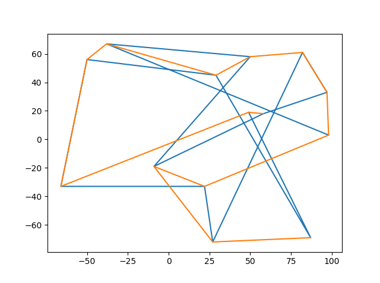
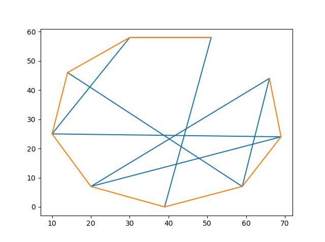
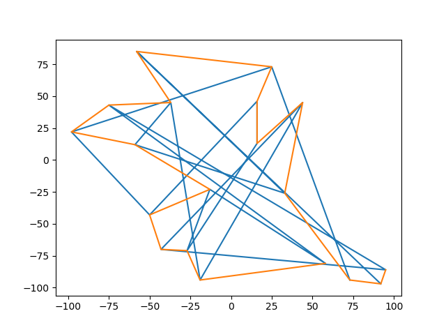

# About
Genetic Algotithm is known as evalutionary algorithm. Typically for Travelling Salesman Problem
it takes O(n!) to solve for n cities. But in this algorithm we can have pretty good
optimization for 20 points. Brute force approach takes __~77 years__ to solve (NP-Compete). But it solves within __~20 seconds to 1 minutes.__
# Installation Guide
Program needs **python v3.7** to run<br>
Additionally, it needs **pip 9.0.3** <br>


```
pip install numpy

pip install matplotlib
```
After that assign any list of tuples to x in [main.py](main.py).
It works as input our Genetic Algorithm. And run the following.
```
python main.py
```
Or, can run the IPython Notebook present in this repository.
# Results
In the following results we will see initial tour of points given in blue line
and optimized solution will be in orange line.<br>

Following Tour consists 14 random points in 2D plane<br><br><br>


Initial Distance :  1151.05001712<br>
Optimized final Distance : 673.365646546<br>
41.499879542 % distance reduced<br>

Following Tour consists 9 random points in 2D plane<br><br><br>


Initial Distance :  385.928147294<br>
Optimized final Distance : 164.35372678<br>
57.4133869395 % distance reduced<br>

Following Tour consists 19 random points in 2D plane<br><br><br>


Initial Distance :  2257.28384077<br>
Optimized final Distance : 770.083105938<br>
65.8845249308 % distance reduced<br>

